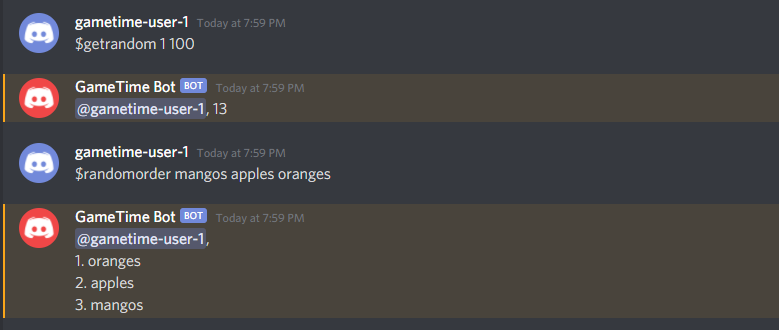
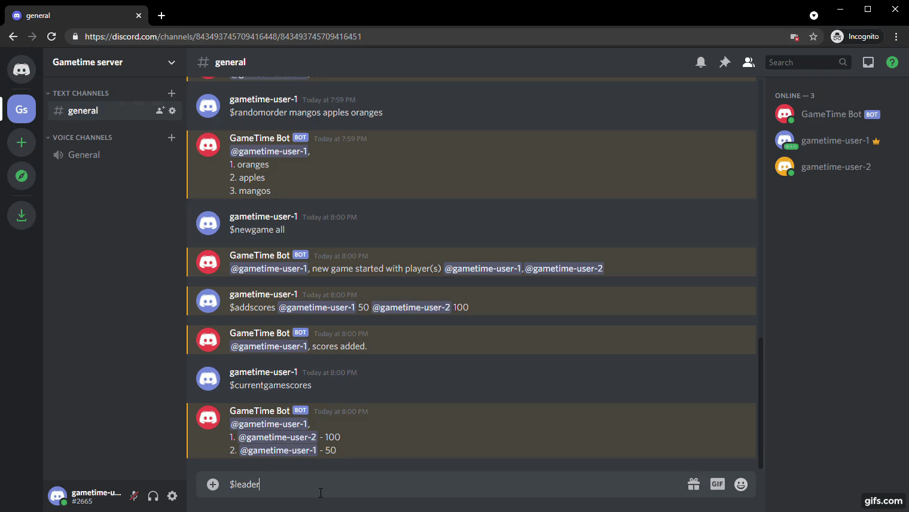
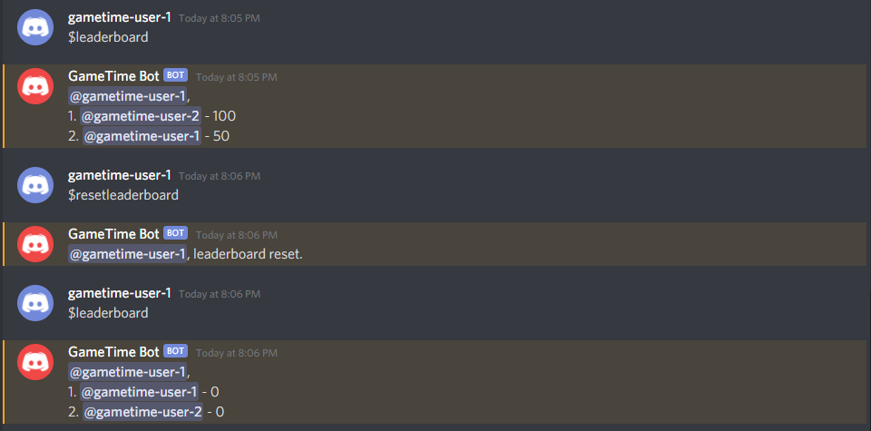

# GameTime Discord Bot

### Click [here](https://discord.com/api/oauth2/authorize?client_id=828998753091584010&permissions=8&scope=bot) to add the bot to your discord server

## Commands

- Type `$help` to get the list of all commands

  

### help

- `$help command` gives more info on the command

  

### rolldice, rolldice2

- `$rolldice` gives a number from 1 to 6
- `$rolldice2` gives 2 numbers from 1 to 6

  

### getrandom, randomorder

- `$getrandom 1 10` gives a number from 1 to 10
- `$randomorder a b c` gives a shuffled list of a, b and c

  

### randomassign

- `$randomassign` takes in a list of roles and their respective counts and assigns a role randomly to each member in the current game

  

### newgame, addscores, currentgamescores

- `$newgame all` starts a new game with all online members
- `$newgame member1_mention member2_mention` starts a new game with the members mentioned/tagged
- `$addscores member1_mention member1_score member2_mention member2_score` updates the current game's scoreboard
- `$currentgamescores` displays the current game's scoreboard

  

### endgame, leaderboard

- `$endgame` ends the current game and adds the scores in the scoreboard to the overall leaderboard
- `$leaderboard` displays the overall leaderboard
- Based on the overall leaderboard, the roles `Gold`, `Silver` and `Bronze` are assigned

  

### cancelgame

- `$cancelgame` ends the current game and _does not_ add the scores in the scoreboard to the overall leaderboard

  

### resetleaderboard

- `$resetleaderboard` clears the overall leaderboard

  
